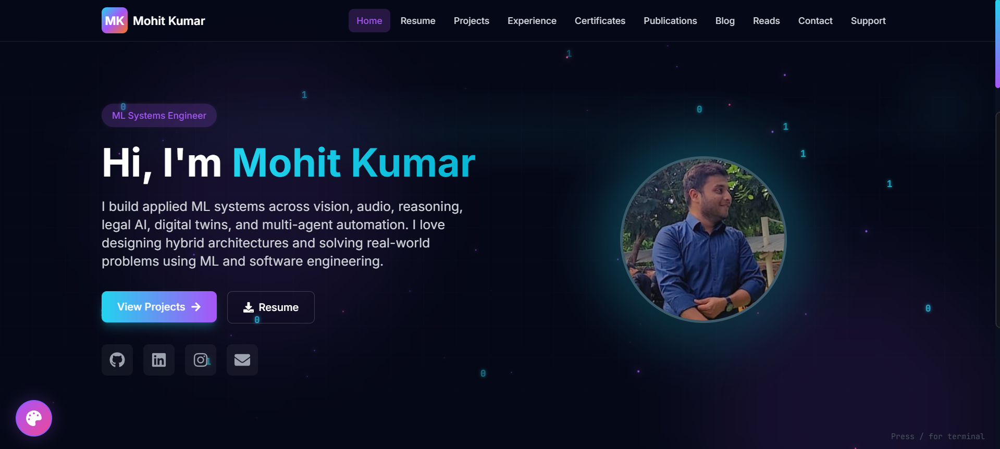

# 🎨 ML-Themed Portfolio

> **🌐 Live Site:** [https://mohitkumar-portfolio.vercel.app](https://mohitkumar-portfolio.vercel.app)

A modern, interactive portfolio website showcasing machine learning projects, research experience, publications, and technical skills. Built with React + Vite frontend and Spring Boot backend, featuring 3D animations, particle effects, and a custom terminal interface.



## ✨ Features

### 🎯 Core Pages
- **Home** - Interactive hero section with animated profile, social links, and role showcase
- **Resume** - Downloadable resume with skills visualization and timeline
- **Projects** - Detailed project cards with filtering, search, and comprehensive writeups
- **Experience** - Internship timeline with clickable project links
- **Certificates** - Achievement showcase with credential verification
- **Publications** - Research papers and technical writing
- **Blog** - Technical articles and insights (Coming Soon)
- **Reads** - Curated reading list and recommendations
- **Contact** - Gmail-integrated contact form with social links
- **Support** - UPI payment integration with QR code

### 🚀 Technical Features
- **3D Animations** - Three.js/React Three Fiber for immersive experiences
- **Particle System** - Dynamic WebGL particle background
- **Framer Motion** - Smooth page transitions and micro-interactions
- **Terminal Interface** - Press `/` for interactive ML-themed terminal with puns
- **Dark Theme** - AI/ML-inspired cyan, orange, purple gradient theme
- **Responsive Design** - Mobile-first Tailwind CSS styling
- **SEO Optimized** - React Helmet for meta tags and social sharing
- **Email Integration** - Gmail SMTP for contact form notifications
- **Performance** - Code splitting, lazy loading, optimized assets

## 🛠️ Tech Stack

### Frontend
- **React 19** - Modern UI library with latest features
- **Vite 7** - Lightning-fast build tool and dev server
- **Tailwind CSS 3** - Utility-first styling framework
- **Framer Motion 12** - Production-ready animation library
- **Three.js + React Three Fiber** - 3D graphics and WebGL
- **Axios** - HTTP client for API requests
- **React Router 7** - Client-side routing
- **React Icons** - Comprehensive icon library
- **React Toastify** - Toast notifications

### Backend
- **Spring Boot 3.2** - Enterprise Java framework
- **Java 17** - Latest LTS version
- **Spring Mail** - Gmail SMTP integration
- **Jackson** - JSON parsing and serialization
- **Maven** - Dependency management and build tool
- **Spring Dotenv** - Environment variable management

### DevOps & Deployment
- **Docker** - Multi-stage containerization
- **Vercel** - Frontend hosting with automatic deployments
- **Render** - Backend hosting with Docker support
- **UptimeRobot** - Free monitoring to prevent cold starts
- **Git/GitHub** - Version control and CI/CD

## 📦 Project Structure

```
portfolio/
├── frontend/                 # React + Vite application
│   ├── src/
│   │   ├── components/      # Reusable UI components
│   │   │   ├── Navbar.jsx
│   │   │   ├── Footer.jsx
│   │   │   ├── Terminal.jsx
│   │   │   ├── ParticleBackground.jsx
│   │   │   ├── ThemeSwitcher.jsx
│   │   │   └── ...
│   │   ├── pages/           # Route pages
│   │   │   ├── Home.jsx
│   │   │   ├── Projects.jsx
│   │   │   ├── ProjectDetail.jsx
│   │   │   ├── Contact.jsx
│   │   │   └── ...
│   │   ├── hooks/           # Custom React hooks
│   │   │   └── useApi.js    # API integration hooks
│   │   ├── contexts/        # React Context providers
│   │   │   └── ThemeContext.jsx
│   │   ├── App.jsx          # Main app component
│   │   └── main.jsx         # Entry point
│   ├── public/
│   │   └── assets/          # Static images, PDFs, QR codes
│   ├── package.json
│   ├── vite.config.js
│   ├── tailwind.config.js
│   └── .npmrc              # npm configuration
│
├── backend/                 # Spring Boot API
│   ├── src/main/java/com/mohit/portfolio/
│   │   ├── PortfolioApplication.java
│   │   ├── controller/
│   │   │   └── ApiController.java    # REST endpoints
│   │   ├── service/
│   │   │   ├── ContentService.java   # JSON file loader
│   │   │   └── EmailService.java     # Gmail integration
│   │   ├── config/
│   │   │   └── CorsConfig.java       # CORS settings
│   │   └── model/
│   │       └── ContactMessage.java   # DTO models
│   ├── src/main/resources/
│   │   ├── application.properties    # App configuration
│   │   └── data/                     # JSON content files
│   │       ├── profile.json
│   │       ├── projects.json
│   │       ├── experiences.json
│   │       ├── certificates.json
│   │       └── ...
│   ├── .env                          # Environment variables (gitignored)
│   ├── Dockerfile                    # Multi-stage Docker build
│   └── pom.xml                       # Maven dependencies
│
├── .gitignore
└── README.md
```

## 🚀 Getting Started

### Prerequisites
- **Node.js** 18+ and npm
- **Java** 17+
- **Maven** 3.9+
- **Docker**
- **Gmail Account** (for contact form)

### 1. Clone Repository

```bash
git clone https://github.com/yourusername/portfolio.git
cd portfolio
```

### 2. Frontend Setup

```bash
cd frontend
npm install
```

Create `.env.local` (optional for local development):
```env
VITE_API_URL=http://localhost:8080/api
```

**Run development server:**
```bash
npm run dev
```
Frontend runs at `http://localhost:5000`

### 3. Backend Setup

```bash
cd backend
```

Create `.env` file:
```env
GMAIL_USERNAME=your-email@gmail.com
GMAIL_APP_PASSWORD=your-16-char-app-password
```

**Get Gmail App Password:**
1. Go to [Google Account Security](https://myaccount.google.com/security)
2. Enable 2-Step Verification
3. Search "App passwords"
4. Create app password for "Mail"
5. Copy 16-character password to `.env`

**Run Spring Boot:**
```bash
./mvnw spring-boot:run
# Or on Windows:
mvnw.cmd spring-boot:run
```

Backend runs at `http://localhost:8080`

### 4. Test Locally

- Frontend: `http://localhost:5000`
- Backend API: `http://localhost:8080/api/profile`
- Test all pages and contact form

## 🐳 Docker Deployment

### Build and Run Backend

```bash
cd backend
docker build -t portfolio-backend .
docker run -p 8080:8080 \
  -e GMAIL_USERNAME=your-email@gmail.com \
  -e GMAIL_APP_PASSWORD=your-app-password \
  portfolio-backend
```

## ☁️ Production Deployment

### Backend → Render.com (Free Forever)

1. **Sign up at [render.com](https://render.com)** with GitHub
2. **New + → Web Service**
3. **Connect your repository**
4. **Configure:**
   - Name: `mohitkumar-portfolio-backend`
   - Root Directory: `backend`
   - Runtime: **Docker**
   - Instance Type: **Free**
5. **Environment Variables:**
   - `GMAIL_USERNAME` = `your-email@gmail.com`
   - `GMAIL_APP_PASSWORD` = `your-16-char-password`
6. **Deploy** (wait 5-10 minutes)
7. **Copy URL**: `https://mohitkumar-portfolio-backend.onrender.com`

### Frontend → Vercel (Free)

1. **Sign up at [vercel.com](https://vercel.com)** with GitHub
2. **Import Repository**
3. **Configure:**
   - Project Name: `mohitkumar-portfolio`
   - Root Directory: `frontend`
   - Framework: **Vite**
4. **Environment Variables:**
   - `VITE_API_URL` = `https://mohitkumar-portfolio-backend.onrender.com/api`
5. **Deploy**
6. **Get URL**: `https://mohitkumar-portfolio.vercel.app`

### Keep Backend Alive with UptimeRobot (Free)

1. **Sign up at [uptimerobot.com](https://uptimerobot.com)**
2. **Add Monitor:**
   - Type: **HTTP(s)**
   - URL: `https://mohitkumar-portfolio-backend.onrender.com/api/profile`
   - Interval: **5 minutes**
3. **Done!** Backend stays warm 24/7

## 📝 Content Management

All content is stored as JSON files in `backend/src/main/resources/data/`:

- **profile.json** - Personal info, bio, social links
- **projects.json** - Project portfolio with detailed writeups
- **experiences.json** - Internships and work experience
- **certificates.json** - Achievements and credentials
- **publications.json** - Research papers and articles
- **skills.json** - Technical skills and proficiencies
- **events.json** - Conferences, workshops, talks
- **posts.json** - Blog articles
- **reads.json** - Book recommendations
- **buymeacoffee.json** - Support page configuration

**To update content:**
1. Edit JSON files in `backend/src/main/resources/data/`
2. Commit and push to GitHub
3. Render auto-deploys backend
4. Content updates instantly

## 🎨 Customization

### Theme Colors (Tailwind Config)

Located in `frontend/tailwind.config.js`:

```js
colors: {
  vision: '#22d3ee',    // Cyan - Computer Vision
  reasoning: '#f97316', // Orange - Reasoning
  audio: '#a855f7',     // Purple - Audio
  // Customize these to match your brand
}
```

### Adding New Pages

1. Create component in `frontend/src/pages/NewPage.jsx`
2. Add route in `frontend/src/App.jsx`
3. Add nav link in `frontend/src/components/Navbar.jsx`
4. Create data endpoint in `backend/controller/ApiController.java`
5. Add JSON file in `backend/src/main/resources/data/`

### Terminal Commands

Edit `frontend/src/components/Terminal.jsx`:
- Add commands to `COMMANDS` object
- Add ML puns to `ML_PUNS` array
- Customize terminal UI and behavior

## 🔧 API Endpoints

All endpoints prefixed with `/api`:

| Method | Endpoint | Description |
|--------|----------|-------------|
| GET | `/profile` | User profile and social links |
| GET | `/projects` | All projects |
| GET | `/projects/{slug}` | Single project by slug |
| GET | `/experiences` | Work experience timeline |
| GET | `/certificates` | Certificates and achievements |
| GET | `/publications` | Research papers |
| GET | `/skills` | Technical skills |
| GET | `/events` | Events and talks |
| GET | `/posts` | Blog posts |
| GET | `/reads` | Reading list |
| GET | `/buymeacoffee` | Support page config |
| POST | `/contact` | Submit contact form (sends email) |

## 🎯 Environment Variables

### Frontend (.env.local)
```env
VITE_API_URL=http://localhost:8080/api
```

### Backend (.env)
```env
GMAIL_USERNAME=your-email@gmail.com
GMAIL_APP_PASSWORD=your-16-char-app-password
```

### Vercel (Production)
```env
VITE_API_URL=https://your-backend.onrender.com/api
```

### Render (Production)
```env
GMAIL_USERNAME=your-email@gmail.com
GMAIL_APP_PASSWORD=your-16-char-app-password
```

## 🐛 Troubleshooting

### Frontend not loading content?
- Check `VITE_API_URL` is set in Vercel
- Redeploy frontend after setting env var
- Test backend URL directly: `https://your-backend.onrender.com/api/profile`

### Contact form not sending emails?
- Verify Gmail App Password is correct
- Check `.env` file exists in `backend/`
- Ensure 2FA enabled on Google account
- Check Render environment variables

### Backend cold starts?
- Set up UptimeRobot monitoring
- Use `/api/profile` endpoint (not root `/`)
- 5-minute interval prevents Render shutdown

### CORS errors?
- Backend `CorsConfig.java` allows `localhost:*` and `*.vercel.app`
- Add custom domain to allowed origins if needed

## 📊 Performance

- **Lighthouse Score:** 95+ (Desktop)
- **First Contentful Paint:** <1.5s
- **Time to Interactive:** <3s
- **Bundle Size:** ~585 KB (can be optimized with code splitting)
- **Cold Start:** <1s with UptimeRobot
- **API Response:** <200ms

## 🔒 Security

- ✅ Environment variables for sensitive data
- ✅ `.gitignore` excludes `.env` files
- ✅ CORS configured for specific domains
- ✅ Input validation on contact form
- ✅ No sensitive data in frontend bundle
- ✅ Gmail App Password instead of account password

## 📄 License

This project is open source and available under the [MIT License](LICENSE).

## 🤝 Contributing

Contributions, issues, and feature requests are welcome!

1. Fork the repository
2. Create feature branch: `git checkout -b feature/AmazingFeature`
3. Commit changes: `git commit -m 'Add AmazingFeature'`
4. Push to branch: `git push origin feature/AmazingFeature`
5. Open Pull Request

## 👤 Author

**Mohit Kumar**
- GitHub: [@mk12002](https://github.com/mk12002)
- LinkedIn: [mohitkumar111](https://www.linkedin.com/in/mohitkumar111/)
- Email: mohit.kr1103@gmail.com

## 🙏 Acknowledgments

- React Three Fiber community for 3D examples
- Tailwind CSS for utility-first styling
- Spring Boot documentation
- Vercel and Render for free hosting

---

⭐ Star this repo if you find it helpful!
