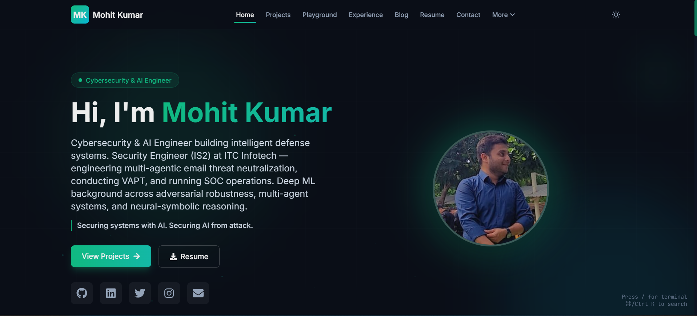

# 🛡️ Mohit Kumar — Security Engineer Portfolio

> **🌐 Live:** [mohitkumar-mu.vercel.app](https://mohitkumar-mu.vercel.app/)

An interactive, security-themed portfolio built around a real body of work: an open-source **security tooling suite**, live in-browser scanner demos, a vuln-report case study, technical writing, and published research. Positioned around **AI for Security & Security for AI** — building intelligent security tooling, and hardening ML/agent supply chains.

Built as a React + Vite SPA that is **fully prerendered per route** (so it serves real content and correct canonicals to crawlers and no-JS clients) and **hardened at the serving layer** (CSP, HSTS, and a CDN-free runtime). A Spring Boot backend is optional — the site runs entirely on bundled fallback content without it.



---

## ✨ Highlights

### 🔐 Security Tooling Suite (the core of the site)
Five open-source scanners, each with a detailed project page, real evaluation data, and engineering-rigor notes:

| Scanner | Domain | Signature capability |
|---|---|---|
| **Bastion** | Kubernetes RBAC | Builds a privilege graph and runs deterministic BFS to `cluster-admin` — finds real escalation *paths*, not per-resource lint |
| **Bulwark** | AI/ML supply chain | Scans models & pipelines (pickle opcode analysis, AI-BOM) for unsafe deserialization and provenance gaps |
| **Stowaway** | Dependencies | Typosquat (Levenshtein), dependency-confusion, and homoglyph detection across `package.json` / `requirements.txt` |
| **Lattice** | Cryptography | Post-quantum readiness and crypto-misuse analysis across many languages |
| **Portcullis** | CI/CD | Pipeline & workflow hardening checks |

Plus **IR-SIEM** — a schema-grounded NL→KQL intermediate representation for SIEM rule generation.

### 🧪 Try it, don't just read it
- **`/demos` — Live scanner demos.** Paste real input and watch it work, 100% client-side:
  - *Bastion:* paste Kubernetes RBAC YAML → renders the escalation edges and the path to `cluster-admin`.
  - *Stowaway:* paste a manifest → flags typosquats / dependency confusion / homoglyphs.
- **`/case-study` — Flagship finding.** A vuln-report walkthrough: *"How Bastion found argo-cd's controller can reach cluster-admin"* — path, evidence, why a hygiene linter misses it, an honest "is it a bug?" read, and the fix.
- **`/playground` — 18 client-side security tools**, including an **AI Security** category (pickle inspector, prompt-injection tester, AI-BOM inspector).
- **`/ctf` — a hidden 7-level CTF** (Base64, header inspection, XOR, JWT `alg:none` forge, …).

### 📚 Everything else recruiters check
- **Home** — terminal hero, a scannable proof band (5 scanners · 1,350+ tests · 47 real escalation paths · 13 posts · 5 papers), an animated software-supply-chain map linking to each scanner, and a mixed "Latest Updates" feed (posts + releases + papers), one-click **Download CV**.
- **Projects / Experience / Publications / Certificates** — full detail pages; publications include **HINT-Net** (*Scientific Reports*, Nature Portfolio — accepted).
- **Blog** — 13 technical posts (AI-BOM, excessive agency, pickle RCE, OWASP LLM Top 10, agentic browsers, …) with local cover images and cross-links to the relevant scanner.
- **Contact** — serverless (Web3Forms) with a graceful `mailto` fallback; no backend required.

---

## 🛠️ Tech Stack

**Frontend:** React 19 · Vite 7 · Tailwind CSS 3 · Framer Motion 12 · React Router 7 · react-helmet-async · @vercel/analytics · React Icons · React Toastify

**Backend (optional):** Spring Boot 3.2 · Java 17 · Jackson · Maven — serves the same JSON the frontend already bundles as fallback.

**Hosting:** Vercel (frontend) · Render (optional backend).

> Three.js/R3F was **removed** — the supply-chain map is pure SVG/Framer, keeping the bundle lean.

---

## 🔒 Security & SEO pipeline

This is a security engineer's site, so it's built to pass the scans a security engineer would run.

### Serving-layer hardening (`frontend/vercel.json`)
- **Content-Security-Policy** — `default-src 'self'`; **no `unsafe-inline`/`unsafe-eval` for scripts** (the one inline theme script is allowed by **SHA-256 hash**, not a wildcard); tight `img`/`font`/`style`/`connect`/`form-action`; `frame-ancestors 'none'`; `object-src 'none'`; `upgrade-insecure-requests`.
- **HSTS** — `max-age=63072000; includeSubDomains; preload`.
- `X-Content-Type-Options: nosniff`, `X-Frame-Options: DENY`, `Referrer-Policy`, `Permissions-Policy`, `X-XSS-Protection: 0` (modern guidance — CSP supersedes it).
- **No third-party CDN in the runtime.** Mermaid diagrams (on the legacy email-security page) are served from a **self-hosted, version-pinned** `public/vendor/mermaid-10.9.1.min.js` — so no external origin appears in the CSP.
- **XSS-safe by construction** — no `dangerouslySetInnerHTML`, React auto-escaping, `rel="noopener"` on external links.

### Per-route prerendering (`frontend/scripts/prerender.mjs`, postbuild)
The SPA is prerendered to **46 static routes**, each with a route-correct `<title>`, meta, **canonical**, `og:`/`twitter:` tags, and real fallback body content — so crawlers and no-JS clients get a real page, not an empty shell. The script **fails the build loudly** on an empty body, a missing canonical, a failed injection, or a duplicate route.

### Post-deploy verification (`frontend/scripts/verify-deploy.mjs` → `npm run verify:prod`)
Runs against the **live URL** and asserts each route serves per-route canonical + `og:url` + `twitter:url` + real body content, **and** that all six security headers are actually present. Exits non-zero so it can gate a deploy.

### Content sync (`frontend/scripts/sync-content.mjs`, prebuild)
Copies `backend/src/main/resources/content/*.json` → `frontend/src/data/*Content.json` so the frontend renders identical content **with or without** the backend running. (Blog posts live in `frontend/src/data/postsData.js`.)

---

## 📦 Project Structure

```
portfolio/
├── frontend/                      # React + Vite SPA (deployed to Vercel)
│   ├── public/
│   │   ├── assets/                # profile.jpg, og-image.png, screenshots
│   │   ├── posts/                 # local blog cover images
│   │   ├── resume/Mohit_Kumar.pdf # served CV (hero "Download CV")
│   │   ├── vendor/                # self-hosted mermaid (no CDN)
│   │   └── sitemap.xml
│   ├── scripts/
│   │   ├── sync-content.mjs        # prebuild: backend JSON → src/data
│   │   ├── prerender.mjs           # postbuild: per-route static HTML + SEO
│   │   └── verify-deploy.mjs       # post-deploy live-URL + header checks
│   ├── src/
│   │   ├── pages/                  # Home, Projects, Demos, CaseStudy, Playground, CTF, …
│   │   ├── components/             # Navbar, NodeGraph (supply-chain map), SEO, …
│   │   ├── data/                   # *Content.json (synced) + postsData.js
│   │   ├── hooks/useApi.js         # backend-first, fallback-to-bundled-JSON
│   │   └── App.jsx
│   └── vercel.json                 # rewrites + security headers
│
├── backend/                        # Spring Boot API (optional)
│   └── src/main/resources/content/ # source-of-truth JSON content
│
├── Resume/main.tex                 # résumé source (LaTeX)
└── README.md
```

---

## 🚀 Getting Started

### Frontend (all you need)
```bash
cd frontend
npm install
npm run dev          # http://localhost:5000
```
Optional `.env.local`:
```env
VITE_API_URL=http://localhost:8080/api      # else the site uses bundled fallback content
VITE_WEB3FORMS_KEY=your-web3forms-key        # else the contact form falls back to mailto
```

**Build & verify:**
```bash
npm run build        # prebuild syncs content, build, postbuild prerenders 46 routes
npm run verify:prod  # checks routes + security headers on the live URL
```

### Backend (optional)
```bash
cd backend
# .env: GMAIL_USERNAME / GMAIL_APP_PASSWORD (only if you wire the Java mail path)
./mvnw spring-boot:run   # http://localhost:8080
```

---

## 🧭 Deployment (Vercel)

1. Import the repo, set **Root Directory** = `frontend`, framework **Vite**.
2. (Optional) env: `VITE_API_URL`, `VITE_WEB3FORMS_KEY`.
3. Deploy. `vercel.json` applies the rewrites (per-route → prerendered HTML, then SPA fallback) and the security headers.
4. Run `npm run verify:prod` to confirm the live serving layer.

> **To update the CV:** replace `frontend/public/resume/Mohit_Kumar.pdf`.
> **To refresh the social card:** edit `frontend/public/og-image.svg` and export it to `og-image.png` at 1200×630.
> **HSTS preload:** the header is set; to join the browser preload list, submit once at [hstspreload.org](https://hstspreload.org).

---

## 👤 Author

**Mohit Kumar** — Security Engineer
- GitHub: [@mk12002](https://github.com/mk12002) · LinkedIn: [mohitkumar111](https://www.linkedin.com/in/mohitkumar111/) · Email: mohit.kr1103@gmail.com
- Writing: [dev.to/mohit_kumar1](https://dev.to/mohit_kumar1) · [hashnode.com/@mkd](https://hashnode.com/@mkd)

---

⭐ Star the repo if it's useful.
